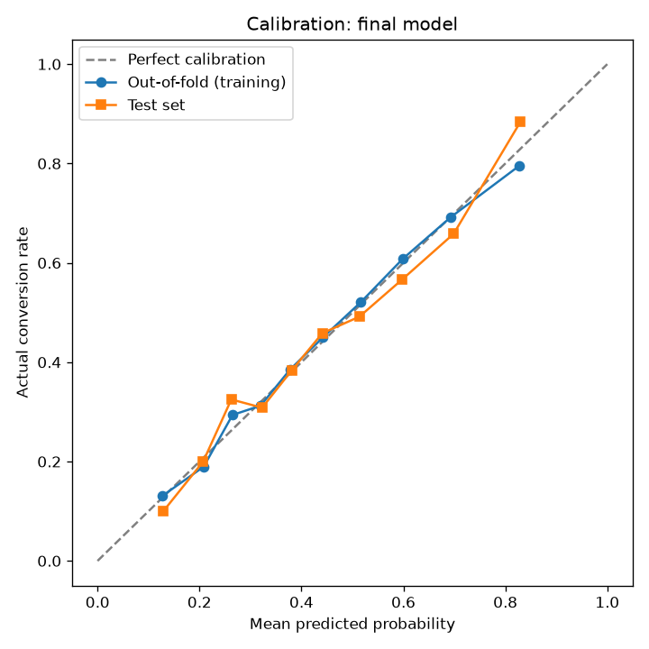

# Calibration Analysis: Final Model

Generated by `python src/calibration_analysis.py` from the saved pipeline (no retraining).
Sanity check: reproduced test ROC-AUC = 0.7492 (published: 0.7492).

## What calibration means

A model is calibrated if, among leads it scores at about 70%, about 70% actually convert. Ranking quality (ROC-AUC) and calibration are separate properties: a model can rank leads well and still output inflated or deflated probabilities.

## Results

| Metric | Out-of-fold (training) | Test |
|---|---|---|
| Brier score (lower is better) | 0.2035 | 0.1998 |
| Brier, base-rate-only baseline | 0.2461 | 0.2461 |
| Brier skill score (higher is better) | 0.173 | 0.188 |
| Expected calibration error (10 bins) | 0.0101 | 0.0407 |

**Verdict:** on the test set the model is well calibrated (ECE 0.041). These numbers come from synthetic data and will drift with real behaviour.

## Reliability table (test set, 10 equal-size bins)

| Bin | Mean predicted | Actual conversion rate | Gap |
|---|---|---|---|
| 1 | 0.129 | 0.100 | -0.029 |
| 2 | 0.207 | 0.200 | -0.007 |
| 3 | 0.262 | 0.325 | +0.063 |
| 4 | 0.323 | 0.308 | -0.015 |
| 5 | 0.381 | 0.383 | +0.003 |
| 6 | 0.441 | 0.458 | +0.017 |
| 7 | 0.514 | 0.492 | -0.022 |
| 8 | 0.598 | 0.567 | -0.031 |
| 9 | 0.698 | 0.658 | -0.040 |
| 10 | 0.829 | 0.883 | +0.054 |

## Threshold under different business costs

If probabilities are calibrated, the cost-minimising threshold is **t = 1 / (1 + r)**, where r = cost of missing a real buyer / cost of one wasted sales call. Values below use out-of-fold training predictions (the test set is not used for this choice).

| r (miss : wasted call) | Threshold t | Recall | Precision | Leads flagged |
|---|---|---|---|---|
| 1 : 1 | 0.500 | 0.562 | 0.664 | 37.1% |
| 2 : 1 | 0.333 | 0.807 | 0.565 | 62.6% |
| 3 : 1 | 0.250 | 0.912 | 0.514 | 77.7% |
| 5 : 1 | 0.167 | 0.974 | 0.466 | 91.5% |
| 10 : 1 | 0.091 | 0.999 | 0.446 | 98.1% |

The current threshold 0.32 (chosen by maximum F1) corresponds to r = 2.1, i.e. it assumes a missed buyer costs about that many times a wasted call. That ratio is an **assumption**; a real deployment should set it from actual deal value and sales capacity.
